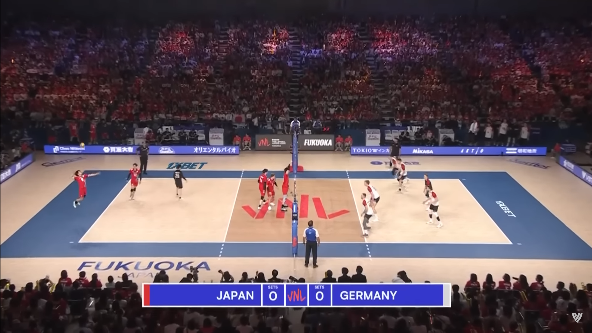
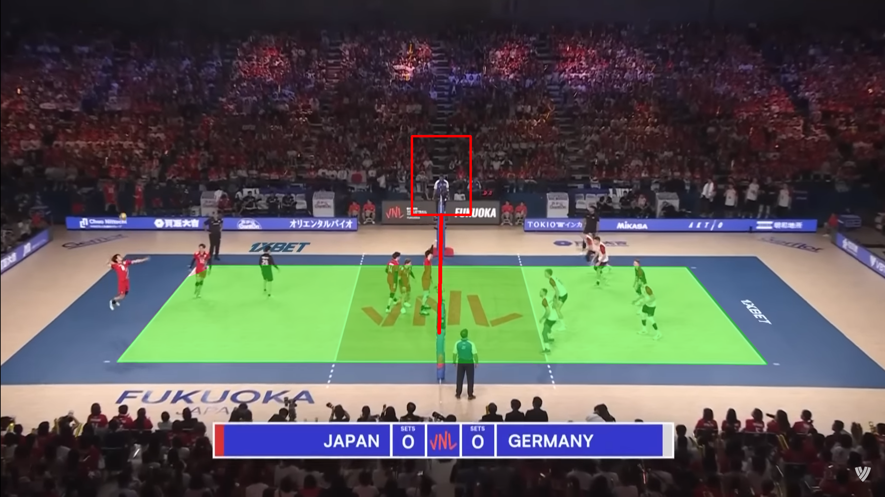

# VolleyMap

In this project, we use exclusively image elaboration algorithms to locate the field, the net and the referee in a volleyball court.

Before  | After
:-------------------------:|:-------------------------:
<a></a> | <a>

## Setup

In order to run the project, multiple python modules are needed. Run the following command to install them
```sh
pip install -r requirements.txt
```